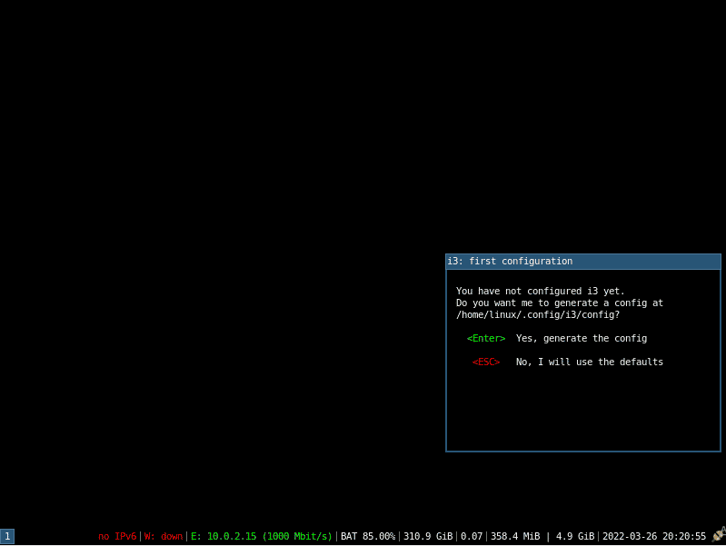
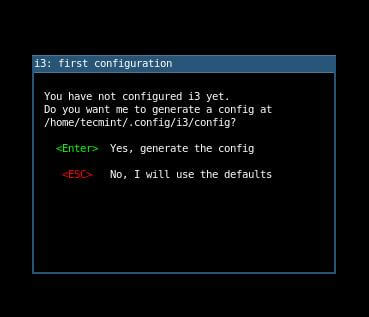
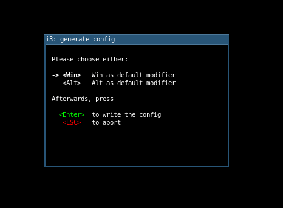

# Arch Linux Installation Guide

This guide covers everything you need to install a full fledged Arch Linux System with KDE Plasma Desktop Environment.


# Initial Configuration

## Network Config for liveiso

<details>
    <summary>Connect using Wi-Fi</summary>

* `systemctl start iwd` - Starts IW Daemon
* `systemctl start dhcpcd` - Starts DHCP Client Daemon
* `ifconfig` - Check Wi-Fi Interface Name (wlan0/wlo1/wlp2s0)
* `iwctl station <interface> connect "<ssid>"` - Enter password after hitting enter
</details>
<details>
    <summary>Connect using USB Tethering</summary>

* Connect your phone with your PC using USB Cable
* Enable USB Tethering in your phone from Settings
</details>

### Check Connection
* `ping -c 3 1.1.1.1` - Check if DHCP is working
* `ping -c 3 archlinux.org` - Check if DNS is working

## Timezone Config for liveiso

* `timedatectl set-timezone <Region/City>` - Put your timezone here (Asia/Kolkata)
* `timedatectl set-ntp true` - Enable Network Time Sync
* `timedatectl set-local-rtc true` - Sync local time with hardware clock

## Partitioning Filesystem

* `fdisk -l` - List Devices and Partitions
* `cfdisk /dev/<device>` - Make 3 partitions:
1. 512M EFI System Partition (`<efi>`)
2. 8.8G Linux Swap Partition (`<swap>`)
3. Remaining Size (Preferably 140.3G) Linux Filesystem (`<root>`)<br><br>then write and quit

* `fdisk -l` - Check the partition numbers properly.
* `mkfs.fat -F 32 /dev/<efi>` - Format the EFI Filesystem in Fat32
* `mkswap /dev/<swap>` - Format the Swap Filesystem

## Mounting Filesystem

### Mount Root

<details>
    <summary>BTRFS as root (Skip to next section for EXT4 guide)</summary>

* `mkfs.btrfs -f /dev/<root>` - Format the Root Filesystem in B-Tree Filesystem
* `mount /dev/<root> /mnt` - Mount the Root to /mnt

## Create BTRFS Subvolumes

* `btrfs su cr /mnt/@`
* `btrfs su cr /mnt/@home`
* `btrfs su cr /mnt/@var`
* `btrfs su cr /mnt/@opt`
* `btrfs su cr /mnt/@tmp`
* `btrfs su cr /mnt/@.snapshots`

## Unmount Root

* `umount /mnt`

## Mount "@" subvolume to /mnt

* `mount -o noatime,commit=120,compress=zstd,space_cache=v2,subvol=@ /dev/<root> /mnt`

## Create necessary mountpoints

* `mkdir /mnt/{boot,home,var,opt,tmp,.snapshots}`

## Mount other subvolumes with proper options

* `mount -o noatime,commit=120,compress=zstd,space_cache=v2,subvol=@home /dev/<root> /mnt/home`
* `mount -o noatime,commit=120,compress=zstd,space_cache=v2,subvol=@opt /dev/<root> /mnt/opt`
* `mount -o noatime,commit=120,compress=zstd,space_cache=v2,subvol=@tmp /dev/<root> /mnt/tmp`
* `mount -o noatime,commit=120,compress=zstd,space_cache=v2,subvol=@.snapshots /dev/<root> /mnt/.snapshots`
* `mount -o subvol=@var /dev/<root> /mnt/var`
</details>
<details>
    <summary>OR, EXT4 as root</summary>

* `mkfs.ext4 /dev/<root>` - Format the Root Filesystem in Ext4 Filesystem
* `mount /dev/<root> /mnt` - Mount the Root to /mnt
</details>

## Mount Boot and Swap

* `mkdir /mnt/boot/efi` - Make the EFI mount point folder
* `mount /dev/<efi> /mnt/boot/efi` - Mount the EFI Partition
* `swapon /dev/<swap>` - Using the Swap Partition

# Installing the Base System with Linux/Linux Zen Kernel

* `nano /etc/pacman.conf` - Uncomment the following:

`Color`\
`ParallelDownloads = 5`

`[multilib]`\
`Include = /etc/pacman.d/mirrorlist`

then save (Ctrl + S) and exit (Ctrl + X)

* `pacstrap /mnt base linux linux-firmware vim nano btrfs-progs` - Select the default.
> **NOTE:** If you want **Linux Zen** Kernel, replace "`linux`" with "`linux-zen`".\
**Don't** replace "`linux-firmware`".\
Also, if you are using **Ext4**, then "`btrfs-progs`" is **not** needed.
* `genfstab -U /mnt >> /mnt/etc/fstab` - Generating fstab configuration

# Chrooting

* `arch-chroot /mnt`
> **NOTE:** Chroot environment is the environment running inside the root directory of the new system. It is the environment in which the installation actually takes place. Do not exit this environment until the installation is complete, or the system may not boot properly. Also, don't be confused if you see same commands again. It's because you are now in the new system.

## Network Configuration

* `echo "<hostname>" > /etc/hostname` - Replace `<hostname>` with your hostname here
* `echo 127.0.0.1$'\t'localhost >> /etc/hosts`
* `echo ::1$'\t\t'localhost >> /etc/hosts`
* `echo 127.0.1.1$'\t'$(cat /etc/hostname) >> /etc/hosts`

## Locale Configuration

* `nano /etc/locale.gen` - Uncomment your locale here (en_US.UTF-8)
* `locale-gen` - Generates your locales based on "`/etc/locale.gen`"
* `echo "LANG=en_US.UTF-8" > /etc/locale.conf`
* `export $(cat /etc/locale.conf)`

## Installing necessary packages

* `nano /etc/pacman.conf` - Uncomment the following:

`Color`\
`ParallelDownloads = 5`

`[multilib]`\
`Include = /etc/pacman.d/mirrorlist`

then save (Ctrl + S) and exit (Ctrl + X)

* `pacman -Syy sudo linux-headers efibootmgr grub intel-ucode git base-devel grub-btrfs dkms avahi os-prober ntfs-3g terminus-font`
> **NOTE:** If you have an **AMD Processor** instead, replace "`intel-ucode`" with "`amd-ucode`"\
If you have installed "`linux-zen`" in the previous pacstrap command, then replace "`linux-headers`" with "`linux-zen-headers`"\
Also, if you have Ext4 then "`grub-btrfs`" is not required.

## Adding Console Font
* `echo "FONT=ter-112n" > /etc/vconsole.conf` - Adds Terminus Font to Console

## Adding a sudo user

* `passwd` - Enter new password for root
* `useradd -s /bin/bash -mG wheel <username>` - Enter your new username (`<username>`)
* `passwd <username>` - Enter new password for your new user
* `EDITOR=nano visudo` - At the bottom of the file, uncomment the line "`%wheel ALL=(ALL:ALL) ALL`", save (Ctrl + S) and exit (Ctrl + X)

## Installing a Bootloader (GRUB)

* `grub-install --target=x86_64-efi --bootloader-id="Arch Linux" --efi-directory=/boot/efi --recheck` - Installing GRUB
> **NOTE:** If your UEFI Entry disappears on reboot due to the requirement of known location to bootable file before showing up UEFI NVRAM Boot
entries, just use "`--removable`" flag after the whole command.

* `nano /etc/default/grub` - Uncomment the line at the end of file saying "`GRUB_DISABLE_OS_PROBER=false`"
* `mkinitcpio -P` - Generating Initramfs
* `grub-mkconfig -o /boot/grub/grub.cfg` - Generating GRUB Configuration file

## Installing a Desktop Environment or Window Manager
<details>
    <summary>Installing KDE Plasma</summary>

* `pacman -S plasma plasma-wayland-session kde-applications sddm gnu-free-fonts noto-fonts noto-fonts-emoji packagekit-qt5 gnome-keyring cronie pipewire-media-session pipewire-jack phonon-qt5-vlc tesseract-data-ind python-pyqt5 xdg-desktop-portal-kde` - Read carefully and select the options\
Go for `all` in the options, then wait till installation
* `pacman -R colord colord-kde` - Fixes screen color issues
* `systemctl enable NetworkManager sddm avahi-daemon` - Enabling KDE's NetworkManager, Display Manager and Avahi Daemon
* `exit` - Exiting Chroot
* `reboot now` - Rebooting to Installed Arch Linux. Do not forget to change DE to **Plasma (X11)**.
</details>

<details>
    <summary>Installing i3wm</summary>

* `su - <username>` - Login to your user account
* `sudo pacman -S xorg xorg-xinit i3-wm i3lock i3status i3blocks dmenu alacritty networkmanager` - Read carefully and select the options\
Go for `all` in the options, then wait till installation
* `sudo cp /etc/x11/xinit/xinitrc ~/.xinitrc`
* `sudo nano ~/.xinitrc` - Do as instructed below:
    1. Remove the part at the end of file saying:
        ```bash
        tun &
        xclock geometry 50x50-1+1 &
        xtern geometry 80x50+494+51 &
        xtern geometry 80x20+494-0 &
        exec xtern geometry 80x66+0+0 -nane login.
        ```
    2. Write the following in it:
        ```bash
        exec i3
        ```
    Save (Ctrl + S) and Exit (Ctrl + X)
* `exit` - Exiting User Account
* `exit` - Exiting Chroot
* `reboot now` - Rebooting to Installed Arch Linux
* Login to tty1 with the username and password you chose
* `startx` - This will initiate the i3wm. It would look something like the image given below
<div align=center>
    
</div>

* A Dialog box like the one given below should appear
<div align=center>
    
</div>

Press Enter to Create a Configuration File for i3wm which we will Edit later on
* Another Dialog box like the one given below should appear asking you to select the Modifier Key. Select the key you want to use as the modifier key and press Enter.
<div align=center>
    
</div>

> **NOTE:** If you are using an Apple keyboard, the Win key will be the Command key
* In order to open a terminal press `mod key + Enter`.
* In order to open **dmenu** hit `mod key + d`.
> **NOTE:** The mod key is the key which you have selected earlier in the modifier key dialog box before.
</details>

> **NOTE:** If you are a **Beginner**, then it is Recommended to Install **KDE Plasma** as it is a full-fledged Desktop Environment with Lots of Features and Applications. i3wm is a Window Manager which is Very Minimal and requires a Lot of Configuration to be done manually. If you are new to Window Managers, then try it in a Virtual Machine first.

# Post Install Configuration

## Installing an AUR Helper (YAY)

* `cd /opt`
* `sudo git clone https://aur.archlinux.org/yay-git.git`
* `sudo chown -R $USER:$USER ./yay-git`
* `cd yay-git`
* `makepkg -si`

<details>
    <summary>Optional: Performance Tweak for YAY</summary>

* `sudo pacman -S ccache`
* `sudo nano /etc/makepkg.conf`

Find **BUILDENV** and remove the exclamation (`!`) mark from "`ccache`" like this:

`BUILDENV=(fakeroot !distcc color ccache check !sign)`

Find MAKEFLAGS, uncomment it and edit the numerical value to the number of CPU threads you have. For example, for 16 threads, do this:

`MAKEFLAGS="-j16"`

Save (Ctrl + S) and Exit (Ctrl + X)

* Run the following command to add ccache to your PATH:

```bash
cat >> /etc/bash.bashrc << EOF
export PATH="/usr/lib/ccache/bin/:$PATH"
EOF
```
<details>
    <summary>Optional: For Zsh Users</summary>

```bash
cat >> /etc/zsh/zshrc << EOF
export PATH="/usr/lib/ccache/bin/:$PATH"
EOF
```
</details>
</details>

## Installing NVIDIA Drivers

* Run the following command to create a hook for NVIDIA Drivers:
```bash
cat > /etc/pacman.d/hooks/nvidia.hook << EOF
[Trigger]
Operation=Install
Operation=Upgrade
Operation=Remove
Type=Package
Target=nvidia
Target=nvidia-dkms
Target=nvidia-lts
Target=linux
Target=linux-zen

[Action]
Description=Update NVIDIA module in initcpio
Depends=mkinitcpio
When=PostTransaction
NeedsTargets
Exec=/bin/sh -c 'while read -r trg; do case $trg in linux) exit 0; esac; done; /usr/bin/mkinitcpio -P'
EOF
```
> **NOTE:** If you have installed **Linux Zen** Kernel, then replace "`linux`" with "`linux-zen`" in the last line.

Save (Ctrl + S) and Exit (Ctrl + X)

* `yay -S nvidia-dkms nvidia-utils lib32-nvidia-utils opencl-nvidia lib32-opencl-nvidia nvidia-settings` - Installing NVIDIA Drivers
> **NOTE:** Some **Laptops** come with NVIDIA Optimus Technology by which the NVIDIA GPU is used only when needed, otherwise an Integrated Intel/AMD GPU is used. If you have such a laptop, then expand and follow the Optimus section below. This is usually **not required for Desktops**.
<details>
    <summary>Optional: NVIDIA Optimus</summary>

* `yay -S nvidia-prime` - Installing NVIDIA Optimus

This package comes with a script called prime-run which can be used to run any application with NVIDIA GPU.

For **example**, to run Steam with NVIDIA GPU, do this:
* `prime-run steam`
</details>

## Installing FlatPak

* `sudo pacman -S flatpak`
* `sudo flatpak remote-add --if-not-exists flathub https://flathub.org/repo/flathub.flatpakrepo` - Adding FlatHub repo
* `sudo flatpak override --filesystem=xdg-config/gtk-3.0` - Forcing FlatPak to use System GTK Themes
* `reboot` - Reboot to complete installation
<details>
    <summary>Alternate: Installing Snapd</summary>

* `yay -S snapd`
* `sudo systemctl enable snapd snapd.socket snapd.seeded snapd.apparmor`
* `sudo ln -s /var/lib/snapd/snap /snap`
* `reboot` - Reboot to complete installation
</details>

## Installing Plymouth

* `sudo pacman -S plymouth`

### Configure Initramfs

* `sudo nano /etc/mkinitcpio.conf`

Edit **HOOKS** to have "`plymouth`" after "`base`" and "`udev`" and **MODULES** to have "`i915`" (for **Intel GPU** only) at beginning like this:

`MODULES=(i915 ...)`\
`HOOKS=(base udev plymouth ...)`

> **NOTE:** If you have **AMD GPU**, replace "`i915`" with "`amdgpu`" and for **NVIDIA GPU**, replace it with "`nvidia nvidia_modeset nvidia_uvm nvidia_drm`"

> **NOTE:** For **Laptops** having a **dGPU** and an **iGPU**, consider using **iGPU** in this part, i.e., usually Intel GPU or AMD GPU.

Save (Ctrl + S) and Exit (Ctrl + X)

### Regenerate Initramfs

* `sudo mkinitcpio -P`

### Configure GRUB

* `sudo nano /etc/default/grub`

Edit `GRUB_CMDLINE_LINUX_DEFAULT` to have "`splash`" after "`quiet`" like this:

`GRUB_CMDLINE_LINUX_DEFAULT="quiet splash"`

Save (Ctrl + S) and Exit (Ctrl + X)

### Regenerate GRUB Configuration

* `yay -S update-grub`
* `sudo update-grub`

### Install a Plymouth Theme

* `yay -S plymouth-theme-arch-breeze-git`
* `sudo plymouth-set-default-theme -R arch-breeze`
> **NOTE**: To list all available themes, run `plymouth-set-default-theme -l`
* `reboot` - Reboot to complete installation

## Install a better GRUB Theme (Xenlism GRUB Theme)

* `git clone https://github.com/xenlism/Grub-themes.git`
* `cd ./Grub-themes/xenlism-grub-arch-1080p/`
> **NOTE:** If your monitor has a higher resolution than 1080p, then select the theme directory accordingly.
* `sudo ./install.sh`
* `reboot now` - Reboot to complete installation

## Install Missing Kernel Headers

* `yay -S mkinitcpio-firmware`

## Install better shell (Oh-My-Zsh)

### Install Zsh

* `sudo pacman -S zsh zshdb zsh-syntax-highlighting zsh-autosuggestions zsh-history-substring-search`
* `touch ~/.zshrc` - Create Initial Empty Zsh Config
* `chsh -s /bin/zsh` - Change Default Shell to Zsh
zsh
* `sh -c "$(curl -fsSL https://raw.github.com/ohmyzsh/ohmyzsh/master/tools/install.sh)"` - Install Oh-My-Zsh on top of zsh
* `nano .zshrc`

Edit the value of `ZSH_THEME` to "`xiong-chiamiov`" like this:

`ZSH_THEME="xiong-chiamiov"`

Edit the last line of the file to have the following:

```bash
cat >> ~/.zshrc << EOF
source /usr/share/zsh/plugins/zsh-syntax-highlighting/zsh-syntax-highlighting.zsh
source /usr/share/zsh/plugins/zsh-history-substring-search/zsh-history-substring-search.zsh
source /usr/share/zsh/plugins/zsh-autosuggestions/zsh-autosuggestions.zsh
EOF
```

Save (Ctrl + S) and Exit (Ctrl + X)

* `reboot` - Reboot to complete installation

## Install Google Chrome and Microsoft Edge Web Browser

* `yay -S google-chrome microsoft-edge-stable-bin`

<details>
    <summary>Optional: Enable Dark Mode in Google Chrome</summary>
Edit the application launcher to have the following as the command:

`/usr/bin/google-chrome-stable --enable-features=WebUIDarkMode --force-dark-mode %U`
</details>

## Configure Automatic System Backup

* `yay -S timeshift timeshift-autosnap`

Open Timeshift from your app launcher and set **BTRFS Backup** to *Boot*, *Daily* and *Hourly*. Also select `@home` subvolume for backup. That's it.

## Install BlackArch Repository
* `curl -O https://blackarch.org/strap.sh`
* `chmod +x strap.sh`
* `sudo ./strap.sh`
* `sudo pacman -Syyu`

## Allow udisks to mount disks without asking sudo password

* Run the following command to create a rule for udisks:

```bash
cat > /etc/polkit-1/rules.d/.rules << EOF
polkit.addRule(function(action, subject) {
    if (((action.id == "org.freedesktop.udisks2.filesystem-fstab") ||
        (action.id == "org.freedesktop.udisks2.filesystem-fstab")) &&
        subject.local && subject.active) {
        return polkit.Result.YES;
    }
});

polkit.addRule(function(action, subject) {
    if (((action.id == "org.freedesktop.udisks2.filesystem-mount-system") ||
        (action.id == "org.freedesktop.udisks2.filesystem-mount-system")) &&
        subject.local && subject.active) {
        return polkit.Result.YES;
    }
});
EOF
```
Save (Ctrl + S) and Exit (Ctrl + X)

* `reboot` - Reboot to apply changes
